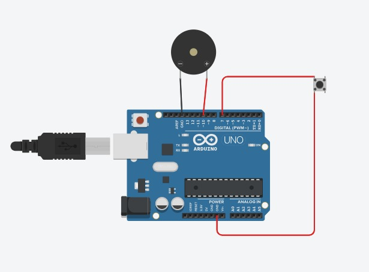

# RageButton
Ragebutton

The rage button is a big button to release your fustration it releases a alarming sound from a buzzer 
it uses
Component	Quantity	Notes
Arduino UNO	1	Microcontroller
Pushbutton (SPDT or normal)	1	Big red button recommended
Active buzzer	1	Works with digitalWrite
Jumper wires	2	For connections
USB cable	1	For programming Arduino

Wiring - 
Button 1A - Arduino pin 7
Button 1B  - GND
Buzzer + - Arduino pin 10
Buzzer – - GND

 

I also made a 3d model using onshape
 
